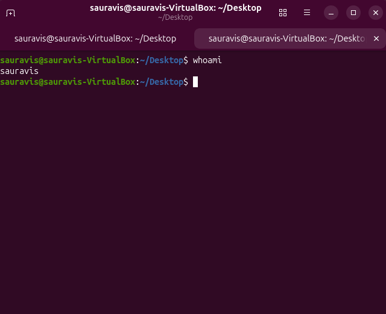
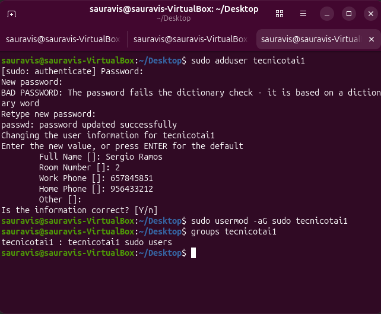
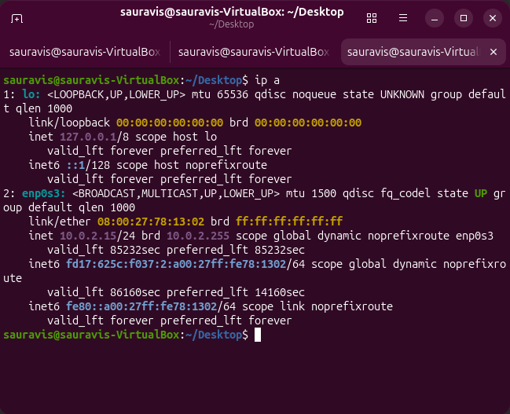
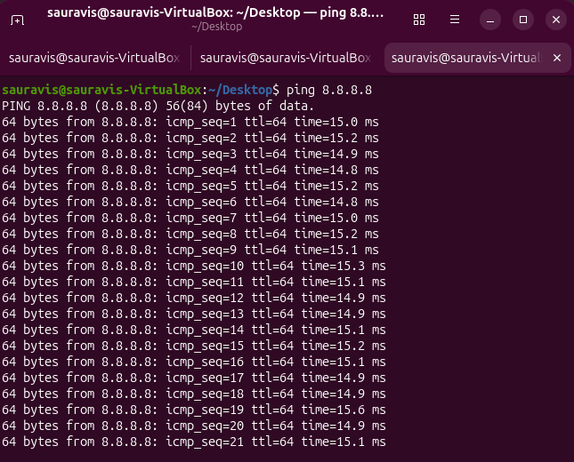
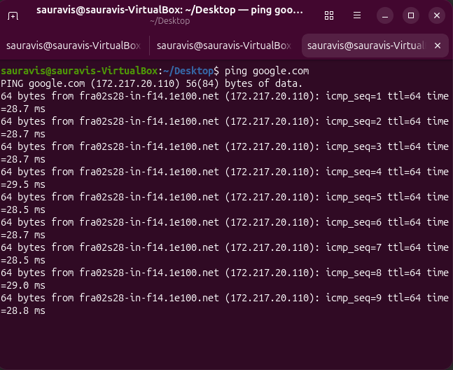

# 🖥️ IT Home Lab

## 🎯 Objective
This project simulates a basic IT support and system administration environment using Linux.

---

## 🧩 What this project includes

- Linux user management
- Network configuration and testing
- Basic troubleshooting scenarios
- System diagnostics

---

## 📁 Sections

- linux-basics → user management, permissions  
- networking → IP, DNS, connectivity tests  
- troubleshooting → simulated IT incidents  
- screenshots → evidence of all tasks  

---

## 🛠️ Technologies

- Ubuntu Linux  
- Bash  
- Networking tools (ping, ip)  

---

## 📌 Purpose

This project was created to practice IT support skills and system administration basics for real-world scenarios.

---

## 📸 Screenshots

## 👤 Users & Permissions

  

  

---

## 🌐 Networking

  

  

  

---

## 👨‍💻 Author

José Diego Ramos  
